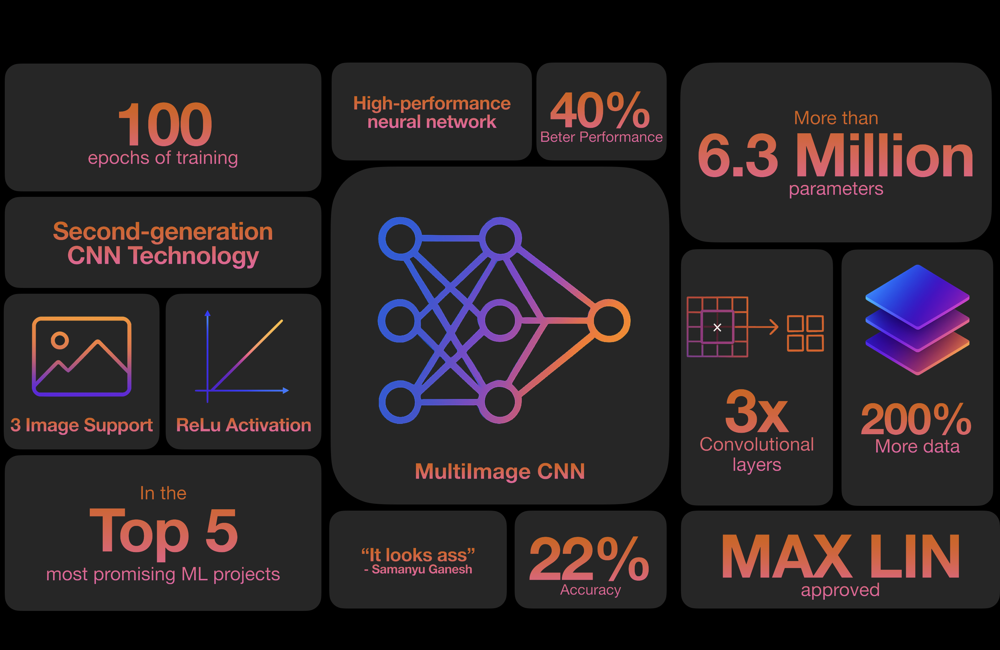

# CalorieTracker

AI model that determines nutritional information from images. 
[Presentation](assets/MachineLearningPresentation.key)
## Example

| Image | Example Response |
|-------|------------------|
|   | Calories: 267.62  Mass: 231.74  Fat: 8.71  Carbs: 21.64  Protein: 15.53 |

## Features

- Input: Photo of a food item or meal
- Output: Predicted calorie count
- Built using a custom-trained convolutional neural network
 

## Dataset

This project uses the [Nutrition5k dataset](https://github.com/google-research-datasets/Nutrition5k) as the primary source for food images and corresponding nutritional values.

## Future Work

- Create a model that takes in text-based features (eg. list of known ingredients)

## Acknowledgments

Special thanks to:
- The creators of the **Nutrition5k dataset**
- **ChatGPT** for assistance throughout the development process
